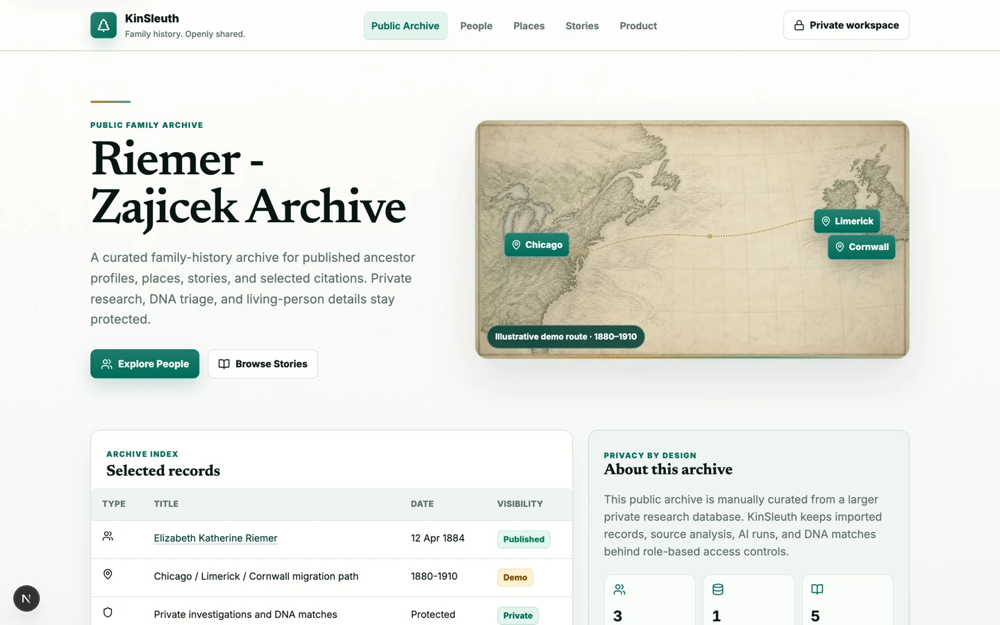
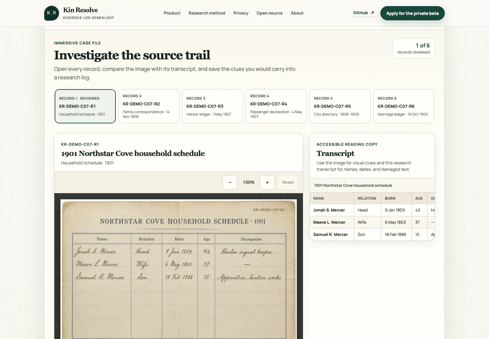
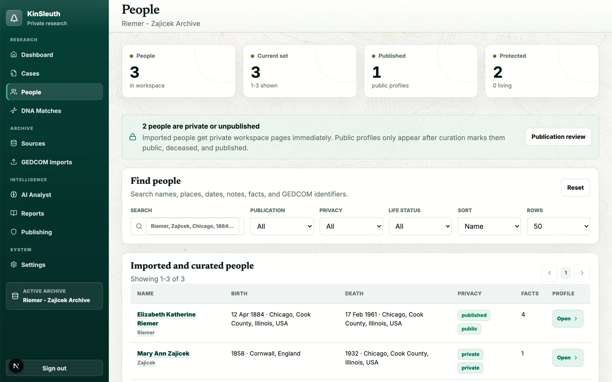
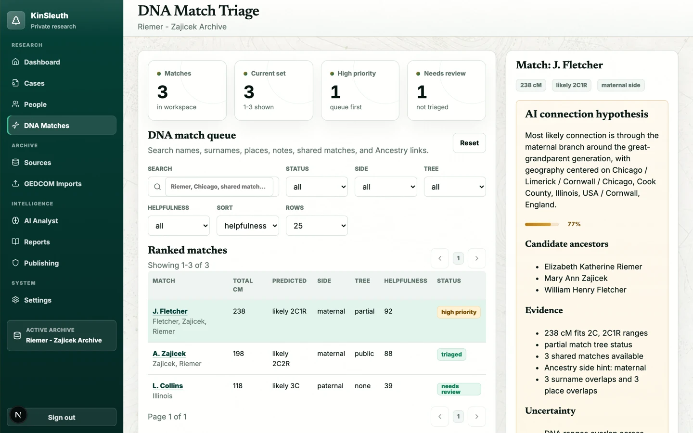
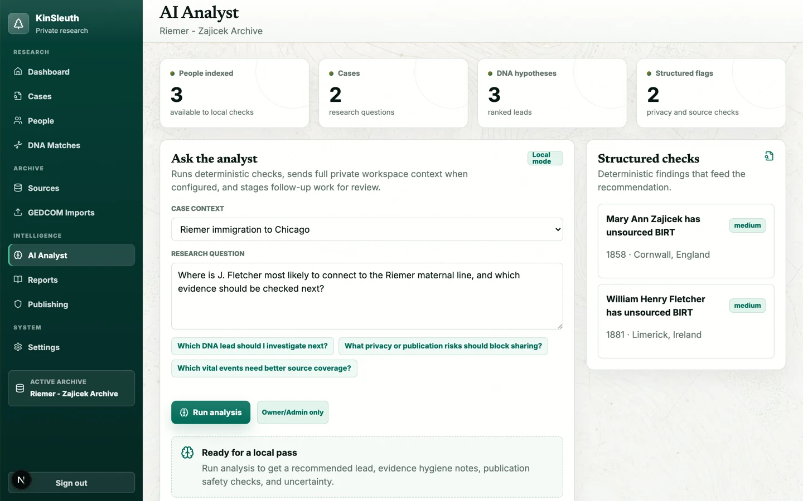
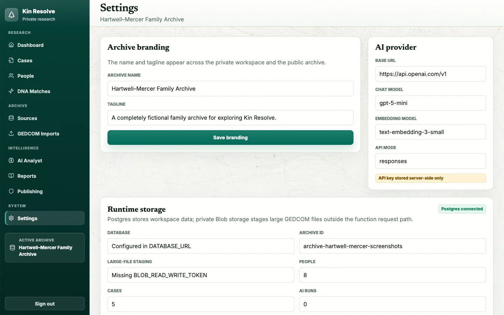

<div align="center">

# 🌲 Kin Resolve

**Self-hosted genealogy research workspace — a private investigation lab paired with a curated public family archive.**

[](LICENSE)
[](https://nextjs.org)
[](https://react.dev)
[](https://github.com/pgvector/pgvector)
[](https://vitest.dev)

*Import and refresh tree exports from Ancestry, Family Tree Maker, RootsMagic, or any GEDCOM-producing app; triage DNA matches; build research cases; and publish selected deceased profiles through privacy gates.*

<p><em>Every person, record, place, photograph, story, and DNA value shown below belongs to the wholly fictional Hartwell–Mercer demo.</em></p>


</div>

---

## Why Kin Resolve?

Most genealogy tools make you choose between *sharing everything* and *sharing nothing*. Kin Resolve splits the difference with two faces on one database:

| 🔒 Private workspace (`/app`) | 🌍 Public archive (`/`) |
| --- | --- |
| Every imported person, source, DNA match, and research note | Only profiles you explicitly curate and publish |
| Account-gated pages and APIs (owner-created accounts) | Living, private, and sensitive records withheld automatically |
| Research cases, task queues, AI analysis runs | Published deceased profiles and facts already marked public |

The repository ships with the wholly fictional **Hartwell–Mercer Family Archive**. Every included name, date, place, record, photograph, story, and DNA value was invented for Kin Resolve; no detail represents a real person or family. Real GEDCOM exports, DNA match files, and uploads belong in ignored local storage (`data/`, `uploads/`).

## Hosted private beta — proposed, not live

The hosted private beta at `app.kinresolve.com` is a gated proposal, not a currently available service. Owner and counsel approval remains pending, and real family data must not be accepted until the launch gates in the [hosted beta contract](docs/hosted-beta-contract.md) pass.

The proposed first cohort is intentionally narrow:

- Plain GEDCOM imports only: up to 10 MiB (10,485,760 bytes) and 40,000 people.
- Sources are transcript-only: metadata, links, and pasted text/transcripts are allowed; binary source and evidence uploads are disabled.
- Deterministic local analysis makes no external provider call; external-provider AI is disabled.
- DNA is disabled.
- The public archive is disabled.
- Real-data public publishing is disabled.
- ZIP and package media are disabled.

These hosted limits do not narrow the features available to local/self-hosted operators. Hosted deployment requires the exact seven-flag manifest documented below and in the beta contract.

## Feature tour

### Public family archive

A curated, privacy-gated site for the ancestors you choose to share — published profiles pass both a manual publish flag *and* automated living/privacy gates before anonymous visitors see them. Current controls are person-level; granular fact/source curation and persisted stories are still in progress.



### Immersive synthetic research challenge

Open thirty period-inspired record images across five immersive investigations, compare accessible transcripts, save cited observations to a clue notebook, and state conclusions without erasing unresolved conflicts. The cases span identity, provenance, photograph dating, same-name reconstruction, and DNA clustering, and run entirely in the browser with fictional data.



### Investigation dashboard

Workspace metrics, cases in motion, an action queue of privacy and quality problems, and top DNA signals — all computed from your actual archive.

### People workspace

Server-paginated search over every imported person with publication, privacy, and life-status filters plus per-person curation controls.



### Remembered data sources with reviewable refreshes

The **Data sources** workspace presents import paths for Ancestry's downloaded ZIP or GEDCOM, media-capable Family Tree Maker and RootsMagic packages, and generic GEDCOM files. The provider-neutral persistence and API foundation remembers each source and models later exports against the last applied snapshot and current local research. Its review contract groups additions, edits, conflicts, and deletions; a missing remote record keeps the local record by default.

This is an export workflow, not an Ancestry account connection: Kin Resolve never asks for Ancestry credentials, automates Ancestry pages, or writes changes back. Every non-GEDCOM file in a ZIP must pass the private malware scanner before review, including unreferenced attachments. FTM and RootsMagic media packages fail closed unless the private-media feature, documented legal-review gate, and a versioned user rights acknowledgement are all present. Retained media starts third-party restricted, private, non-publishable, and excluded from AI context; an authenticated owner can attest that a file is user-owned without automatically making it public or AI eligible.

Apply and rollback requests are archive-scoped and idempotent. An apply writes the selected incoming entities and its pre-apply backup in the same transaction; rollback restores that backup. Raw GEDCOM records, xrefs, custom tags, source references, and checksums remain available for provenance. Private package storage uses archive-namespaced keys, and the registered Postgres worker handler provides exclusive leases, retries, cancellation, and redacted status errors. Production enablement requires a configured storage backend plus either the long-running worker or bounded scheduled invocation.

Your data is never locked in: the whole archive exports back to GEDCOM 5.5.1 from the Data sources page (or `GET /api/exports/gedcom`), with curation flags carried as compatibility-preserved custom `_KS_` tags. The explicit legacy Kin Resolve migration path can restore those tags; the provider-neutral Data sources workflow treats incoming publication controls as untrusted and always creates new people private and unpublished. See [Data source integrations](docs/data-source-integrations.md) for the provider boundary, API, deployment, rights, and rollout contract.

### DNA match triage

Import DNA match CSVs, rank matches by a helpfulness score (shared cM, tree status, surnames, places, shared matches), edit match details, link matches to cases as evidence, and generate connection hypotheses with candidate common ancestors.



### AI Analyst

Deterministic structural checks (date conflicts, privacy risks) run with no API key at all. Add an OpenAI-compatible provider key and the analyst answers research questions with cited workspace context, saved run history, and staged case-task suggestions you approve before they land.



### Publishing readiness & quality reports

Per-profile readiness scoring, publication blockers, source-coverage gaps, and low-confidence facts — reviewed before anything goes public.


## Quick start

```bash
git clone https://github.com/erichare/kinresolve.git
cd kinresolve
npm install
cp .env.example .env
docker compose up -d postgres
npm run archive:provision -- --mode demo
npm run dev
```

Open [http://localhost:3000](http://localhost:3000). The provisioning command creates the versioned, wholly fictional demo exactly once; rerunning it verifies the same persisted mode without resetting later work.

> `DATABASE_URL` is required (the `.env.example` default matches the bundled Postgres service). Private `/app` routes are open in local development; set a long `AUTH_SECRET` and create the owner account at `/setup` to protect them.

### Full stack via Docker Compose

```bash
cp .env.example .env
# Set MINIO_ROOT_USER and MINIO_ROOT_PASSWORD in .env before continuing.
docker compose up --build
```

Before starting Compose, set unique non-empty `MINIO_ROOT_USER` and `MINIO_ROOT_PASSWORD` values in `.env` (for example, generate the password with `openssl rand -hex 32`). Compose fails closed when either value is missing and supplies the same credential pair to the app, worker, MinIO, and bucket initializer.

Compose provisions Postgres with pgvector, explicitly provisions the versioned fictional demo, and starts private MinIO object storage alongside the production app. Both the app and worker wait for that one-shot provisioning service. The MinIO API and console are published only on the host loopback interface at ports `9000` and `9001`. The data-source storage contract uses archive-namespaced keys; legacy general source-file attachments still use local disk. MinIO allows direct-upload CORS from `http://localhost:3000`; production deployments must configure their exact HTTPS app origin for multipart `POST` uploads. Durable job state lives in Postgres, and the worker runs the registered export parser continuously by default. The web and worker processes share database, storage, and rollout configuration.

## Route map

| Route | Purpose |
| --- | --- |
| `/` | Public archive landing page |
| `/people`, `/people/[slug]` | Published people and profiles |
| `/stories`, `/places` | Synthetic demo stories and the public place index |
| `/challenge` | Five immersive investigations across thirty fictional records with browser-local progress |
| `/app` | Investigation dashboard |
| `/app/people` | Search, filter, and curate people |
| `/app/cases` | Research cases, evidence, hypotheses, and task queues |
| `/app/dna` | DNA match triage and connection hypotheses |
| `/app/sources` | Source register and transcript review |
| `/app/imports` | Remembered Ancestry/FTM/RootsMagic/GEDCOM data sources, reviewable refreshes, rollback, and full-archive GEDCOM export |
| `/app/ai` | AI Analyst with saved run history |
| `/app/reports` | Quality and evidence reports |
| `/app/publishing` | Public-profile readiness review |
| `/app/settings` | Archive branding, provider, storage, and role reference |
| `/api/health` | JSON runtime health (`200` healthy / `503` degraded) |

## Configuration

`.env.example` documents every supported variable:

| Variable | Notes |
| --- | --- |
| `DATABASE_URL` | **Required.** Postgres connection string for workspace storage |
| `DATABASE_POOL_MAX` | Max connections per instance; use `2` for serverless |
| `DATABASE_AUTO_MIGRATE` | Applies pending versioned migrations at boot; hosted production requires exactly `false` and uses the candidate workflow's dedicated migration connection |
| `KINRESOLVE_DEPLOYMENT_MODE` | `self-hosted` or `hosted`; required in hosted production and set explicitly by the bundled Compose stack |
| `KINRESOLVE_DATASET_MODE` | Persisted archive contract: `empty`, versioned fictional `demo`, or real-data `pilot`; required for hosted deployments and provisioning |
| `KINRESOLVE_DNA_ENABLED` | Hosted cohort one: `false`; server-side DNA capability gate |
| `KINRESOLVE_EXTERNAL_AI_ENABLED` | Hosted cohort one: `false`; prevents external-provider analysis calls |
| `KINRESOLVE_PUBLIC_ARCHIVE_ENABLED` | Hosted cohort one: `false`; disables anonymous archive surfaces |
| `KINRESOLVE_PUBLIC_PUBLISHING_ENABLED` | Hosted cohort one: `false`; disables publication mutations independently from archive visibility |
| `KINRESOLVE_EVIDENCE_BINARY_UPLOADS_ENABLED` | Hosted cohort one: `false`; permits transcript-only sources while rejecting binary source/evidence uploads |
| `KINRESOLVE_PACKAGE_MEDIA_ENABLED` | Hosted cohort one: `false`; disables ZIP/package media retention |
| `KINRESOLVE_PLAIN_GEDCOM_ENABLED` | Hosted cohort one: `true`; admits only `.ged`/`.gedcom` files subject to the fixed 10 MiB and 40,000-person limits |
| `KINSLEUTH_ALLOW_SIGNUPS` | Hosted releases require exactly `false`; self-hosted first-run signup remains available when no account exists |
| `KINRESOLVE_GUIDED_RESEARCH_ENABLED` | Server-side kill switch for the private case guide and its mutation APIs; defaults to `true`, set `false` to disable without deleting research history |
| `KINRESOLVE_EXPORT_REFRESH_ENABLED` | Data-source tree import/refresh gate; defaults to `true` |
| `KINRESOLVE_DESKTOP_MEDIA_ENABLED` | Requests the private FTM/RootsMagic media path; defaults to `false` and is ineffective without the legal-review gate and per-package rights acknowledgement |
| `KINRESOLVE_MEDIA_LEGAL_REVIEW_APPROVED` | Independent operator assertion that the private media rights language and release were reviewed; defaults to `false` |
| `KINRESOLVE_MALWARE_SCANNER` | Worker malware scanner provider: `clamd` or `none`; media-bearing ZIPs fail closed when unset |
| `KINRESOLVE_CLAMD_HOST` / `KINRESOLVE_CLAMD_PORT` | Private clamd TCP endpoint; no filenames or genealogy metadata are sent |
| `KINRESOLVE_MALWARE_SCAN_TIMEOUT_MS` | Whole-file clamd connection/scan timeout, default `30000` |
| `KINRESOLVE_MALWARE_SCAN_MAX_BYTES` | Per-file INSTREAM ceiling, default `25165824`; must not exceed clamd `StreamMaxLength` |
| `KINRESOLVE_ANCESTRY_API_ENABLED` | Future partner-API rollout request; defaults to `false` and has no effect without separate written approval |
| `KINRESOLVE_ANCESTRY_PARTNER_APPROVED` | Independent operator assertion that written Ancestry approval exists; both Ancestry API gates must be true |
| `AUTH_SECRET` | Secret for account sessions (better-auth); required in production |
| `KINRESOLVE_BETA_PRIVACY_HMAC_SECRET` | Separate high-entropy hosted secret used only to HMAC emails, client addresses, actors, and durable rate-limit subjects; never reuse `AUTH_SECRET` |
| `KINRESOLVE_BETA_APPLICATIONS_ENABLED` | Public native application endpoint gate; defaults off and accepts only exact `true` or `false`. Keep it independent from the API release mode |
| `KINRESOLVE_BETA_APPLICATION_HMAC_SECRET` | Required only when native applications are enabled; distinct 32-byte-or-stronger server-only HMAC key for application/email/idempotency identities. Never reuse any app, provider, recovery, database, storage, AI, or release credential |
| `KINRESOLVE_BETA_OPERATOR_AUDIENCE` / `KINRESOLVE_BETA_OPERATOR_KEY_ID` / `KINRESOLVE_BETA_OPERATOR_PUBLIC_KEY_SPKI` | Hosted operator cell identity: exact canonical product origin plus the ID and Ed25519 public key used to verify signed invitation commands |
| `KINRESOLVE_BETA_LEGAL_STATUS` / `KINRESOLVE_BETA_*_{VERSION,SHA256,URL}` | Exact approved participation-terms, privacy-notice, and cohort-boundary metadata; URLs must be versioned paths on `https://kinresolve.com` and their bytes are verified during release, viewing, and acceptance |
| `KINRESOLVE_TRANSACTIONAL_EMAIL_PROVIDER` / `KINRESOLVE_TRANSACTIONAL_EMAIL_FROM` / `KINRESOLVE_TRANSACTIONAL_EMAIL_REPLY_TO` | Hosted release requires Resend with the approved `beta@kinresolve.com` sender and reply-to contract |
| `RESEND_API_KEY` | Sensitive server-only Resend credential for invitations, verification, recovery, and security notifications |
| `KINSLEUTH_ARCHIVE_ID` | Archive id; set explicitly before `npm run archive:provision` (the runtime fallback remains `archive-default` for legacy self-hosted installs) |
| `KINRESOLVE_OBJECT_STORAGE_BACKEND` | Private data-source artifact backend (`s3` or `vercel-blob`); archive namespace enforcement is fixed by the storage contract |
| `BLOB_READ_WRITE_TOKEN` | Server-only credential for Vercel Blob artifact storage and archive-namespaced legacy large-GEDCOM staging |
| `S3_ENDPOINT` | Server/worker endpoint for S3-compatible private artifact reads and writes |
| `S3_PUBLIC_ENDPOINT` | Browser-reachable endpoint used only when signing direct-upload POST policies |
| `MINIO_ROOT_USER` / `MINIO_ROOT_PASSWORD` | **Required for Docker Compose.** Operator-supplied credentials shared by the bundled MinIO service, app, worker, and bucket initializer |
| `S3_BUCKET` / `S3_REGION` / `S3_ACCESS_KEY_ID` / `S3_SECRET_ACCESS_KEY` | Private S3/MinIO bucket and server-only credentials for non-Compose runtimes; Compose derives its access keys from the required MinIO values |
| `KINRESOLVE_WORKER_*` | Worker identity, polling and maintenance intervals, lease duration, per-run parse bound, and bounded staged-upload cleanup limit |
| `CRON_SECRET` | Bearer token for scheduled integration parsing and stale-upload cleanup jobs |
| `RELEASE_FENCE_SECRET` | Dedicated 256-bit-or-stronger base64url/hex bearer token for protected production release-fence transitions; generate with `openssl rand -hex 32` and never reuse `CRON_SECRET` |
| `AI_BASE_URL` / `AI_API_KEY` | OpenAI-compatible provider; deterministic fallback runs without a key |
| `AI_API_MODE` | `responses` (default) or `chat` |
| `AI_CHAT_MODEL` / `AI_EMBEDDING_MODEL` | Chat model for analysis; the embedding model is reserved for planned pgvector retrieval (not implemented yet) |
| `APP_BASE_URL` | Exact canonical origin of the running app; production requires one HTTPS origin such as `https://app.kinresolve.com` and uses it for redirects and cookie-mutation origin checks |

The seven hosted capability flags are required together and fail closed when absent or invalid. They remain commented in `.env.example` so copying that file does not change self-hosted defaults; a hosted operator must uncomment the complete cohort-one manifest. The 10 MiB (10,485,760-byte) and 40,000-person GEDCOM limits are fixed application boundaries, not environment overrides.

Browser-facing cookie mutations are registered explicitly and fail before database or
session access unless `Origin` equals `APP_BASE_URL` exactly and
`Sec-Fetch-Site: same-origin` is present. Better Auth endpoints keep Better Auth's own
origin validation, and cron endpoints require their independent bearer secret. Scripts
should not reuse browser session cookies as an API credential; the versioned bearer API
is a separate release surface. If a trusted diagnostic must reproduce a browser
mutation, it must send both request-origin headers in addition to the protected session
cookie.

Archive name and tagline are edited in **Settings → Archive branding** and flow through both the private workspace and the public site. Settings also reports live database, storage, and AI-provider health.



## Development

```bash
npm run typecheck     # TypeScript
npm run lint          # ESLint
npm run test          # Vitest unit tests
npm run test:db       # Every Postgres-gated suite, serialized (needs TEST_DATABASE_URL)
npm run test:db:large # 10.5+ MB / 65k-person GEDCOM load regression
npm run test:release-upgrade # Rehearse v0.17.4 -> current (needs a local control DB)
npm run test:release-compatibility # Prove archived v0.17.4 is unsafe on current schema (local scratch DBs only)
npm run migrations:verify   # Verify migration checksums and released history
npm run demo:verify # Block retired real-family demo identifiers and images
npm run db:migrate    # Apply pending db/migrations to DATABASE_URL (Node 22.6+)
npm run db:migrate:production # Migrate through MIGRATION_DATABASE_URL only
npm run db:migrations:verify-production # Prove the exact production ledger
npm run db:identity    # Fingerprint DATABASE_IDENTITY_URL from read-only catalogs
npm run storage:identity:provision # Write and fingerprint the private storage sentinel
npm run build         # Production build
```

Node versions are split for now: the product app targets Node 22 (pinned in
`.nvmrc`) while the marketing site in `site/` targets Node 24 (`site/.nvmrc`).
A root `engines` field is deliberately omitted until the runtimes converge:
Vercel builds read `engines.node` ahead of the project setting, so pinning it
is a deployment change, not a documentation change. Converging on a single
version is planned after launch.

Schema changes live as ordered SQL files in `db/migrations/` (`NNN_name.sql`). Applied versions are tracked in the `schema_migrations` table, each file runs in its own transaction, and concurrent runners serialize on an advisory lock. In development the app applies pending migrations at boot (`DATABASE_AUTO_MIGRATE`). The hosted workflow instead deploys an unaliased candidate first, proves that its runtime catalog fingerprint matches the dedicated `MIGRATION_DATABASE_URL`, refuses transaction-pooler port `6543`, preflights the exact approved ledger prefix before DDL, and proves the exact version ledger after applying the immutable checked-in SQL and release policy.

Set `TEST_DATABASE_URL` to a **disposable** Postgres database before running either DB
command—never point it at real data. `test:db` intentionally runs every database-gated
suite serially because several legacy fixture cleanups share an archive prefix. The
command fails before Vitest when the URL is absent or identifies the same database as
`DATABASE_URL`.

The upgrade rehearsal is destructive by design: set
`TEST_RELEASE_UPGRADE_DATABASE_URL` to a separate local disposable control database.
It creates and drops isolated child databases and refuses remote hosts, application/test
database reuse, and connection-routing overrides. The compatibility proof uses that same
guard, archives the exact locally pinned `v0.17.4` tag without fetching or running its
migrations, migrates only tracked `kr_compat_*` children forward to the current immutable
ledger, and executes the tagged login and workspace code with auto-migration disabled.
Its auth, guided-state, integration-reference, and pilot-seed observations must match
`db/release-policy.json` exactly. Product CI gives the standard suite, large-import
regressions, released-schema upgrade rehearsal, and legacy compatibility proof separate
required jobs.

## Data & privacy model

```
Provider export / DNA CSV ──▶ Private workspace (Postgres) ──▶ Curation gates ──▶ Public archive
                                  │                                  │
                                  ├─ raw records and snapshots       ├─ manual publish flag
                                  ├─ reviewable refresh changes      ├─ living-person gate
                                  └─ cases, evidence, AI runs        └─ privacy level gate
```

- Anonymous visitors see only manually published, automatically re-checked public content.
- Imported people default to private; publication requires deceased status and public privacy.
- Pre-import backups store a full workspace snapshot (the ten most recent are retained).
- Before publishing real data, review `/app/publishing` and `/app/reports`, then spot-check the public pages.

| Path | Contents | Git status |
| --- | --- | --- |
| `fixtures/` | Synthetic sample GEDCOM used by tests and demos | committed |
| `uploads/sources/` | Uploaded source files | ignored |
| `data/` | Local GEDCOM, DNA CSV, and research exports | ignored |

## Staging and production releases

Releases are candidate-first. Run `.github/workflows/vercel-release.yml` manually from
`main` with an exact full commit SHA, the matching stable `package.json` version, the
forward-only policy acknowledgement, and an explicit `release_target`. A `staging-only`
run must use application mode with intake disabled and every production recovery, API,
and writer-perimeter input empty. It stops after the isolated staging rehearsal and records
the exact candidate deployment ID, run, attempt, SHA, and version; it cannot enter the
production, marketing, or GitHub Release jobs. A `production` run additionally requires
the run ID plus SHA-256 of a fresh attested attempt-scoped
`production-recovery-evidence-<run_attempt>` artifact and the protected writer-perimeter
acknowledgement. The workflow refuses an existing tag or release; the stable GitHub tag
and Release are created idempotently only after the exact production candidate is live and
verified. GitHub verifies that recovery evidence came from the protected workflow at the
requested `main` commit; typed text is not accepted as backup or quiescence evidence. Git
auto-deployments remain disabled in `vercel.json`.

Protected infrastructure prerequisite: before approving a production release or holding
promotion, a reviewer must verify in the Vercel project dashboard that production
deployment auto-assignment is disabled and that Standard Protection covers every generated
deployment URL without an exception. Promotion can re-enable domain auto-assignment, so the
holding and release workflows immediately set the official project
`autoAssignCustomDomains` field to `false`, independently re-read the exact project, and
refuse to release the database fence until that state is proven. Automatic failure handlers
repeat that repair after runner loss; if the setting cannot be proven, they use Vercel's
project-pause API as the fail-closed fallback. Standard Protection remains a reviewed
dashboard prerequisite and is separately probed on every generated deployment URL. The
checked-in configuration validator also proves `git.deploymentEnabled=false`, `sfo1`, and
the two exact cron definitions. The holding workflow requires the first two exact
acknowledgements. The product-release and recovery workflows additionally require the
protected writer-perimeter acknowledgement before checkout:

```text
I acknowledge Vercel production deployment auto-assignment is disabled in the protected project dashboard.
I acknowledge Vercel Standard Protection covers every generated deployment URL and has no exceptions.
I acknowledge the production writer perimeter contains only the canonical Vercel runtime and protected GitHub release/recovery workflows; no external workers, SQL/API writers, or shared database/Blob credentials remain.
```

That final acknowledgement means the database runtime credential and Blob token exist only
in the canonical Vercel runtime, while migration, fence, backup, and recovery credentials
exist only in their protected GitHub environments. Hosted cells must have no long-lived
worker, Supabase SQL/Data API writer, stale custom-domain deployment, shared service token,
or operator process retaining write access during the fenced interval. The database fence
is application-enforced; this credential and deployment perimeter is therefore a required
part of the release safety boundary, not an optional operational convention.
The runtime role's exact fail-closed grant contract and current single-cell RLS tradeoff
are documented in [Production runtime database role](docs/production-runtime-database-role.md).

After each generated production-target deployment is metadata-validated, the workflow
requires its unauthenticated URL to return a `401` or `403` protection response without
Kin Resolve application content. It then
smokes the same immutable URL with `VERCEL_AUTOMATION_BYPASS_SECRET` before any database
mutation or holding-page promotion.

The rollback target is also checked in and independently deployable: see
[Static maintenance holding deployment](docs/static-holding-deployment.md). Its protected
manual workflow builds a zero-runtime page, stages it with `--skip-domain`, and reports the
validated ID to use as `STAGING_HOLDING_DEPLOYMENT_ID` or
`FIRST_CUTOVER_HOLDING_DEPLOYMENT_ID`, or `DEMO_HOLDING_DEPLOYMENT_ID`, depending on the
selected protected environment;
each target has a separate exact promotion acknowledgement.

The production target has four serialized phases. A staging-only target completes phases
1 and 2 and then emits its immutable candidate evidence:

1. Prove the requested SHA is the workflow's `main` SHA, run the full product/release
   suite, immutable migration checks, build, and production dependency audit without
   Vercel credentials.
2. Prove the protected `beta-staging` canonical origin is on its exact approved static
   holding deployment and smoke that zero-runtime target before mutation. Then rehearse
   the release using a separate target-specific build from the same commit and procedure,
   a separate Vercel project, database, object store, archive, and generated unaliased URL.
   The workflow temporarily promotes that exact candidate for the authenticated browser
   journey, then restores and proves the pinned holding deployment from a fresh finalizer.
   A staging-only run never leaves the candidate promoted or enters production; it must
   upload an attempt-scoped machine evidence artifact containing the candidate ID, run,
   attempt, SHA, and version.
3. In the protected `production` environment, validate Vercel metadata and actual
   readable settings, verify policy and machine-attested recovery/fence evidence, prove
   the canonical alias is on the approved static holding deployment, build and deploy an
   unaliased candidate, attest its runtime database identity, revalidate and smoke the
   holding deployment again immediately before mutation, require the live production
   ledger to equal the exact checksum-bound prefix proved by recovery evidence, migrate
   through the matching dedicated connection, prove the exact final ledger, smoke the
   candidate, and promote it.
4. Prove the canonical alias resolves to the candidate, run the full non-mutating smoke
   while writes remain fenced, disable and independently re-read production domain
   auto-assignment, release that exact fence, rerun the full canonical smoke, revalidate
   the alias and release namespace, then publish the stable GitHub Release in a separately
   retryable final job. A failed post-promotion step must re-contain writes before the alias
   can return to the approved holding deployment.

The legacy staging demo controller is retired and checked in only as a credential-free
historical tombstone. The always-on synthetic public demo uses the dedicated
`kinresolve-demo` project, database, holding target, release workflow, safety workflow, and
monitoring cell. Its exact external configuration, first hostname cutover, release,
rollback, containment, and rehearsal procedure are documented in
[the public demo runbook](docs/public-demo-runbook.md). Public-demo release remains blocked
until GitHub reports the legacy controller manually disabled and idle.

The protected GitHub environments are intentionally separate. Configure their exact
inventory as follows; do not promote a repository-level secret as a shortcut:

- `beta-staging` secrets: `CRON_SECRET`, `KINRESOLVE_OBSERVABILITY_PROBE_SECRET`,
  `MIGRATION_DATABASE_URL`, `STAGING_BROWSER_CANARY_EMAIL`,
  `STAGING_BROWSER_CANARY_PASSWORD`, `STAGING_BROWSER_CANARY_USER_ID`,
  `STAGING_HOLDING_DEPLOYMENT_ID`, `VERCEL_AUTOMATION_BYPASS_SECRET`, `VERCEL_ORG_ID`,
  `VERCEL_PROJECT_ID`, and `VERCEL_TOKEN`; when protected intake rehearsal is enabled it
  also needs `BETA_APPLICATION_CANARY_EMAIL_PATTERN`. Variables: `APP_BASE_URL`,
  `VERCEL_PROJECT_ID`, `KINRESOLVE_OBJECT_STORAGE_PROVIDER_ID`, and the exact protected
  production exclusions `FORBIDDEN_PRODUCTION_DATABASE_IDENTITY`,
  `FORBIDDEN_PRODUCTION_OBJECT_STORAGE_IDENTITY`, and
  `FORBIDDEN_PRODUCTION_OBJECT_STORAGE_PROVIDER_ID`. The pulled Vercel Production setting
  `KINRESOLVE_SCHEDULED_WRITES_ENABLED` must be readable and exactly `false`.
- `production` secrets: `CRON_SECRET`, `FIRST_CUTOVER_HOLDING_DEPLOYMENT_ID`,
  `MIGRATION_DATABASE_URL`, `RELEASE_FENCE_SECRET`, `VERCEL_AUTOMATION_BYPASS_SECRET`,
  `VERCEL_ORG_ID`, `VERCEL_PROJECT_ID`, and `VERCEL_TOKEN`. Variables: `APP_BASE_URL`,
  `VERCEL_PROJECT_ID`, `KINRESOLVE_OBJECT_STORAGE_PROVIDER_ID`, `SUPABASE_PROJECT_REF`,
  `RECOVERY_TARGET_DATABASE_IDENTITY`, `RECOVERY_TARGET_OBJECT_STORAGE_IDENTITY`,
  `RECOVERY_TARGET_OBJECT_STORAGE_PROVIDER_ID`, and
  `RECOVERY_TARGET_SUPABASE_PROJECT_REF`. The two project refs are required release
  evidence bindings and must differ. The pulled scheduled-write setting must be readable
  and exactly `true`.
- `demo-production` is the protected public-demo release environment. Secrets:
  `DEMO_HOLDING_DEPLOYMENT_ID`, `KINRESOLVE_DEMO_CANARY_SECRET`,
  `KINRESOLVE_OBSERVABILITY_PROBE_SECRET`, `MIGRATION_DATABASE_URL`,
  `PUBLIC_DEMO_RUNTIME_DATABASE_URL`, `VERCEL_AUTOMATION_BYPASS_SECRET`,
  `VERCEL_ORG_ID`, `VERCEL_PROJECT_ID`, and `VERCEL_TOKEN`. Variables:
  `APP_BASE_URL`, `KINRESOLVE_DATABASE_IDENTITY`,
  `MARKETING_VERCEL_PROJECT_ID`, `PRODUCTION_DATABASE_IDENTITY`,
  `PRODUCTION_VERCEL_PROJECT_ID`, `VERCEL_ORG_ID`, and `VERCEL_PROJECT_ID`. The exact
  setup and runtime contract are in [the public demo runbook](docs/public-demo-runbook.md).
- `demo-containment` is the matching automatic, no-reviewer safety environment. It carries
  only the pinned holding, monitor/canary, and Vercel control credentials needed to prove a
  compatible rollback, restore exact holding bytes, repair hostname ownership, or pause
  `kinresolve-demo` fail-closed.
- `demo-monitoring` carries `APP_BASE_URL`, the demo canary/health-probe secrets, and an
  optional fixed-schema alert URL. It receives no database, migration, AI, auth, email,
  object-storage, or Vercel deployment credential.
- `beta-staging-containment` is an automatic safety environment with no required reviewers
  or wait timer. Secrets: `STAGING_HOLDING_DEPLOYMENT_ID`, `VERCEL_ORG_ID`,
  `VERCEL_PROJECT_ID`, and `VERCEL_TOKEN`. Variables: `APP_BASE_URL`, `VERCEL_ORG_ID`, and
  `VERCEL_PROJECT_ID`. Its Vercel organization, project, hostname, and pinned holding
  identities must exactly match the `beta-staging` cell; it exists so explicit close and
  failed release/holding/demo runs cannot wait for an interactive deployment approval before
  restoring holding traffic or disabling domain auto-assignment.
- `production-containment` is an automatic safety environment with no required reviewers
  or wait timer. Secrets: `MIGRATION_DATABASE_URL`,
  `FIRST_CUTOVER_HOLDING_DEPLOYMENT_ID`, `VERCEL_ORG_ID`, `VERCEL_PROJECT_ID`, and
  `VERCEL_TOKEN`. Variables: `APP_BASE_URL`, `EXPECTED_ARCHIVE_ID`,
  `KINRESOLVE_DATABASE_IDENTITY`, `VERCEL_ORG_ID`, and `VERCEL_PROJECT_ID`.
- `production-recovery` secrets: `BLOB_READ_WRITE_TOKEN`, `CRON_SECRET`,
  `FIRST_CUTOVER_HOLDING_DEPLOYMENT_ID`, `MIGRATION_DATABASE_URL`,
  `RECOVERY_AGE_IDENTITY`, `RECOVERY_AUTH_SECRET`, `RECOVERY_BACKUP_S3_ACCESS_KEY_ID`,
  `RECOVERY_BACKUP_S3_SECRET_ACCESS_KEY`, `RECOVERY_TARGET_BLOB_READ_WRITE_TOKEN`,
  `RECOVERY_TARGET_DATABASE_URL`, `RECOVERY_TARGET_RUNTIME_DATABASE_URL`,
  `RECOVERY_TARGET_SUPABASE_ACCESS_TOKEN`, `RELEASE_FENCE_SECRET`,
  `SUPABASE_ACCESS_TOKEN`, `VERCEL_AUTOMATION_BYPASS_SECRET`, `VERCEL_ORG_ID`,
  `VERCEL_PROJECT_ID`, and `VERCEL_TOKEN`. Variables: `PRODUCTION_APP_BASE_URL`,
  `EXPECTED_ARCHIVE_ID`, both production database/object identities and provider IDs,
  both `SUPABASE_PROJECT_REF` values, `RECOVERY_TARGET_DATABASE_REPLACEMENT_POLICY`,
  `RECOVERY_AGE_RECIPIENT`, and the recovery S3 bucket, region, and endpoint.
- `production-recovery-cleanup` is target-only. Secrets:
  `RECOVERY_TARGET_BLOB_READ_WRITE_TOKEN`, `RECOVERY_TARGET_DATABASE_URL`, and
  `RECOVERY_TARGET_SUPABASE_ACCESS_TOKEN`. Variables: `EXPECTED_ARCHIVE_ID`, both
  source and target database/object identities and provider IDs, and both source and
  target Supabase project refs. It must not receive the production database, Blob, fence,
  backup, Vercel, or source Supabase write credentials.

Protect the interactive release and recovery environments with reviewers; the automatic
containment and cleanup environments must remain able to respond to runner loss. Staging and
production values must differ. Automatic safety cells require their secret and independently
readable Vercel organization/project IDs to match before any control-plane mutation. The
protected recovery workflow produces one attested release-evidence payload plus a non-secret,
attempt-scoped 90-day cleanup lease. A successful cutover writes only a privacy-safe Actions
summary with the commit, version, deployment IDs, fence ID, and passed gates.

Required Vercel production environment: `DATABASE_URL` (Supabase transaction pooler on
port `6543` with `sslmode=require`—the app upgrades known Supabase pooler connections to
`verify-full` with the bundled root CA), `DATABASE_POOL_MAX=2`,
`DATABASE_AUTO_MIGRATE=false`, `APP_BASE_URL` set to the canonical HTTPS product origin,
`KINRESOLVE_DEPLOYMENT_MODE=hosted`, an explicit `KINRESOLVE_DATASET_MODE`, an explicit
`KINSLEUTH_ARCHIVE_ID`, `KINSLEUTH_ALLOW_SIGNUPS=false`, catalog-derived
`KINRESOLVE_DATABASE_IDENTITY`, sentinel-derived
`KINRESOLVE_OBJECT_STORAGE_IDENTITY`,
`KINRESOLVE_OBJECT_STORAGE_BACKEND=vercel-blob`, guided research and export refresh
enabled, explicit `KINRESOLVE_API_V1_ENABLED` and
`KINRESOLVE_BETA_APPLICATIONS_ENABLED` values, the exact seven-flag
cohort-one manifest, the approved legal manifest, the
audience-bound operator public identity, the approved Resend sender contract,
`AUTH_SECRET`, `KINRESOLVE_API_CURSOR_SECRET`,
`KINRESOLVE_BETA_PRIVACY_HMAC_SECRET`, both observability secrets, `RESEND_API_KEY`,
`BLOB_READ_WRITE_TOKEN`, `CRON_SECRET`, and `RELEASE_FENCE_SECRET`. Every listed
credential, including `DATABASE_URL`, must be a Vercel Sensitive variable. When native
applications are enabled, `KINRESOLVE_BETA_APPLICATION_HMAC_SECRET` is an additional
required Sensitive variable; app-off releases do not require it. Every listed
noncredential setting must remain readable, and every assignment
must be scoped to Production only so the workflow can validate configuration without
reading secret values. Before either staging or production can build, deploy, or mutate a
database, the workflow rejects control-plane-only credentials (including migration/admin
database URLs, recovery/offsite/age credentials, Supabase management tokens, GitHub
tokens, and user-configured Vercel deploy/bypass assignments) from both the complete Vercel metadata inventory
and the pulled runtime environment; validation reports names and counts only, never values.

The first hosted cutover is forward-only: never attach `v0.17.4` to the migrated pilot
database. Provision the fresh, empty pilot cell through `013_release_write_fence.sql`
before loading real data. Recovery evidence rejects every earlier ledger prefix; it may
prove the full candidate ledger as a no-op migration, or, for future releases, prove an
exact prefix containing 013 and apply only the remaining candidate migrations on the
recovery target before production is allowed to advance from that identical prefix. If
promotion or the live smoke fails, automation may move the alias only to the
captured, pre-approved static holding deployment and only after the production write
fence is active. It never runs a down migration or reattaches the legacy application.
A failed, cancelled, or timed-out release run starts a credential-free classifier first.
It independently restores the pinned staging holding deployment, or proves the exact
staging project is paused, before its safety receipt can succeed. It leaves production
alone when the production job was skipped, and it leaves a verified
candidate live when only GitHub publication failed after the final canonical revalidation.
A failed, cancelled, or timed-out production job instead recontains the exact database
fence and rolls back to the pre-approved holding deployment. A failed, cancelled, or
timed-out recovery run starts the target-only recovery janitor, which removes restored
target objects and destroys only the identity-bound disposable target database project.
A failed, cancelled, or timed-out holding promotion starts a target-specific automatic
repair that disables and independently re-reads domain auto-assignment; when promotion may
have occurred and repair cannot be proven, it pauses that exact Vercel project. Every marked
failed source attempt needs its exact successful containment, cleanup, holding-repair, or
demo-session repair receipt before any later release, recovery, holding, or demo run may
load protected credentials.
Vercel's [Cron Jobs rollback guidance](https://vercel.com/docs/cron-jobs/manage-cron-jobs#rollbacks-with-cron-jobs)
and [Instant Rollback guidance](https://vercel.com/docs/instant-rollback) describe different
schedule behavior, so both rollback paths keep the durable write fence active and record mandatory dashboard cron verification; the
zero-runtime holding deployment remains the traffic target until that follow-up is done.
The operator containment runbook remains the fallback if either automation fails. An
alias rollback is not a database rollback, and restore/forward-fix evidence remains a
separate launch gate rather than something inferred from a successful migration.

## Project map

| Path | What lives there |
| --- | --- |
| `app/` | Next.js App Router pages and API routes |
| `components/` | Shared UI and workspace components |
| `lib/` | GEDCOM/package parsing, integrations, private object storage, durable jobs, workspace store, search, DNA, AI, privacy, publishing, reports |
| `db/migrations/` | Versioned Postgres + pgvector schema migrations, tracked in `schema_migrations` |
| `tests/` | Vitest unit and Postgres integration coverage |
| `docs/` | Architecture notes and README screenshots |

## Status & known limitations

Kin Resolve is a working vertical slice suited to local/self-hosted beta use — not yet a production genealogy platform.

- Data-source artifacts have an archive-namespaced private-storage contract; legacy general source-file attachments still target local disk and need the same backend before production use.
- ANSEL-encoded GEDCOM files are decoded on a best-effort basis (UTF-8, UTF-16, and Windows-1252 are handled properly).
- Remembered data sources scope provider identifiers and GEDCOM xrefs to a connection. The legacy direct `/api/imports` path still uses xref-derived record ids, so two unrelated files sent through that legacy route can collide.
- Ancestry support is export-only. Partner OAuth, incremental API pulls, AncestryDNA, hints, messages, and writeback remain disabled unless a future written partner agreement explicitly authorizes them.
- FTM/RootsMagic binary media retention is not implemented. Packages still receive path reconciliation and missing/ambiguous-file reports. All non-GEDCOM ZIP entries must scan clean even while desktop media retention is disabled; retention stays gated on the unfinished rights-attestation release.
- Semantic (pgvector) retrieval is planned but not implemented; the embeddings table is provisioned and unused.
- Durable Postgres jobs provide leases, retries, cancellation, idempotency, and redacted errors. The registered integration parser runs through `npm run worker` for self-hosting or `/api/cron/integration-jobs` for bounded hosted processing. Invitations and member management are still evolving.

## License

Kin Resolve is free software licensed under the [GNU Affero General Public License v3.0](LICENSE) (AGPL-3.0-only). You may self-host, modify, and redistribute it under the AGPL's terms; if you run a modified version as a network service, the AGPL requires you to offer its source to users of that service. See [CONTRIBUTING.md](CONTRIBUTING.md) for contribution terms.
